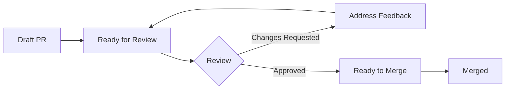

# Code Review Process

Code reviews are essential for maintaining quality, sharing knowledge, and building better conservation technology together. This guide outlines our review philosophy, process, and best practices.

## Philosophy

### Why We Review
- **Quality**: Catch bugs before they reach the field
- **Knowledge Sharing**: Learn from each other's expertise
- **Consistency**: Maintain coding standards across the platform
- **Mentorship**: Help team members grow their skills

### Review Mindset
- Reviews are collaborative, not adversarial
- Focus on the code, not the person
- Suggest improvements, not just problems
- Consider the broader context

## Review Process

### 1. Preparation (Author)

Before requesting review:
```bash
# Run all checks locally
make lint          # Style checks
make test          # Unit tests
make integration   # Integration tests
make build         # Ensure it builds

# Self-review your changes
git diff develop...HEAD

# Update documentation
make docs
```

### 2. Creating the Pull Request

Use our PR template and provide:
- Clear description of changes
- Link to related issues
- Testing evidence
- Screenshots/logs if applicable

Example PR description:
```markdown
## Summary
Implements dynamic power management for Horizon v4 to extend battery life in cold conditions.

## Changes
- Added temperature-based CPU frequency scaling
- Implemented adaptive sampling rates
- Optimised satellite transmission scheduling

## Testing
- Unit tests: 100% coverage on new code
- HIL tested: -20°C to +40°C for 48 hours
- Field tested: 2 devices in Antarctica for 1 week

## Performance Impact
- 35% battery life improvement at -10°C
- No impact on data quality
- Satellite success rate maintained at 97%

Closes #234
```

### 3. Review Assignment

Assign reviewers based on:
- **Code ownership**: Primary maintainer of the module
- **Domain expertise**: Hardware, firmware, cloud, etc.
- **Availability**: Check team calendar
- **Learning opportunity**: Include junior developers

### 4. Performing Reviews

#### First Pass - Architecture & Design
- Does the solution make sense?
- Are there simpler approaches?
- Will this scale with our growth?
- Does it follow our patterns?

#### Second Pass - Implementation Details
- Are edge cases handled?
- Is error handling appropriate?
- Are there performance concerns?
- Is the code maintainable?

### 5. Providing Feedback

#### Effective Comments
```diff
# ❌ Bad: Vague and unconstructive
- This doesn't look right

# ✅ Good: Specific and helpful
+ This timeout might be too short for satellite connections in poor conditions.
+ Consider using SATELLITE_TIMEOUT_MS (300s) instead of hardcoding 30s.
+ Reference: Our field tests show 95% of connections succeed within 180s.
```

#### Comment Types

**🔴 Must Fix** - Blocking issues
```c
// 🔴 Must Fix: Buffer overflow risk
// This can overflow if sensor_count > MAX_SENSORS
memcpy(buffer, sensor_data, sensor_count * sizeof(sensor_t));

// Suggested fix:
size_t copy_size = MIN(sensor_count, MAX_SENSORS) * sizeof(sensor_t);
memcpy(buffer, sensor_data, copy_size);
```

**🟡 Consider** - Suggestions for improvement
```python
# 🟡 Consider: This could be more efficient using NumPy
result = []
for i in range(len(data)):
    result.append(data[i] * 2)

# Alternative:
import numpy as np
result = np.array(data) * 2
```

**💬 Question** - Clarification needed
```javascript
// 💬 Question: Is this intentionally checking for exactly 3 retries?
// Our other modules use >= MAX_RETRIES. Should we be consistent?
if (retryCount === 3) {
    throw new Error('Max retries exceeded');
}
```

**✨ Praise** - Recognise good work
```c
// ✨ Great use of the power management API!
// This will significantly improve battery life.
pm_device_action_run(sensor_dev, PM_DEVICE_ACTION_SUSPEND);
```
## Platform-Specific Reviews

### Firmware (Zephyr RTOS)

Key areas to review:
- **Memory usage**: Stack sizes, heap allocation
- **Power management**: Sleep modes, wake sources
- **Thread safety**: Mutexes, semaphores, atomic operations
- **Device tree**: Pin assignments, peripheral configuration
- **Error recovery**: Watchdog, fault handlers

Example review checklist:
```c
// ✓ Check thread stack sizes
K_THREAD_STACK_DEFINE(sensor_stack, 2048);  // Is this sufficient?

// ✓ Verify ISR constraints
void sensor_isr(const struct device *dev)
{
    // ❌ No blocking calls in ISR
    k_sem_take(&data_sem, K_FOREVER);  // Will cause system hang
    
    // ✅ Use ISR-safe alternatives
    k_sem_give(&isr_sem);  // Defer processing to thread
}

// ✓ Power efficiency
if (k_sem_take(&data_ready, K_SECONDS(30)) != 0) {
    // ✅ Good: Thread sleeps while waiting
    LOG_WRN("Sensor timeout");
}
```

### Hardware Design

Review considerations:
- **Schematic**: Connections, power rails, protection
- **PCB layout**: Trace widths, impedance, thermals
- **BOM**: Component availability, cost, alternatives
- **Mechanical**: Fit, thermal management, assembly

Checklist:
- [ ] Power budget calculated and verified
- [ ] All connectors have ESD protection
- [ ] Test points accessible
- [ ] Manufacturing constraints met
- [ ] Thermal analysis completed

### Cloud Services

Focus areas:
- **Security**: Authentication, encryption, input validation
- **Scalability**: Database queries, caching strategy
- **Cost**: AWS resource usage, data transfer
- **Monitoring**: Metrics, alerts, logging

Example:
```python
# 🔴 Must Fix: SQL injection vulnerability
query = f"SELECT * FROM devices WHERE id = '{device_id}'"

# ✅ Use parameterised queries
query = "SELECT * FROM devices WHERE id = %s"
cursor.execute(query, (device_id,))

# 🟡 Consider: Add rate limiting
@app.route('/api/telemetry', methods=['POST'])
@rate_limit(calls=100, period=timedelta(minutes=1))
def upload_telemetry():
    # Implementation
```

## Review Workflow

### For Reviewers

1. **Acknowledge assignment** - Comment within 24 hours
2. **Complete review** - Within 48 hours for normal PRs
3. **Re-review promptly** - After changes are made
4. **Approve explicitly** - Don't leave it ambiguous

### For Authors

1. **Respond to all comments** - Even if just "Done"
2. **Push fixes as new commits** - Don't force-push during review
3. **Request re-review** - When ready
4. **Squash before merge** - Clean history

### Review States



## Best Practices

### Do's
- ✅ Review promptly - blocking others impacts velocity
- ✅ Be specific - point to exact lines and suggest fixes
- ✅ Consider context - urgent fixes vs. perfect code
- ✅ Learn from reviews - both giving and receiving
- ✅ Use review tools - GitHub suggestions, inline comments

### Don'ts
- ❌ Nitpick style if automated tools handle it
- ❌ Demand perfection for MVP/prototype code
- ❌ Review when tired or rushed
- ❌ Make it personal
- ❌ Approve without understanding

### Review Anti-Patterns

**The Perfectionist**
```
"This works but could be 5% more efficient if we..."
```
*Fix: Consider if optimisation is worth the complexity*

**The Gatekeeper**
```
"This isn't how I would do it"
```
*Fix: Accept different valid approaches*

**The Ghost**
```
*Assigned 5 days ago, no response*
```
*Fix: Communicate availability, delegate if needed*

## Metrics & Improvement

### Track Review Quality
- Time to first review
- Number of review cycles
- Post-merge bug rate
- Team satisfaction

### Regular Retrospectives
- What reviews caught important issues?
- Where did bugs slip through?
- How can we improve the process?

## Emergency Procedures

### Hotfix Reviews
For critical production issues:
1. One senior reviewer minimum
2. Focus on the fix, not perfect code
3. Document shortcuts taken
4. Schedule follow-up improvements

### After-Hours Protocol
- Use `#emergency-review` Slack channel
- Tag `@on-call-reviewer`
- Provide context and urgency level
- Consider timezone-appropriate reviewers

## Tools & Automation

### Automated Checks
Configure CI to run before human review:
```yaml
# .github/workflows/pr-checks.yml
name: PR Checks
on: pull_request

jobs:
  automated-review:
    runs-on: ubuntu-latest
    steps:
      - name: Code Format
        run: make format-check
        
      - name: Lint
        run: make lint
        
      - name: Security Scan
        run: make security-scan
        
      - name: Test Coverage
        run: |
          make test-coverage
          if [ $COVERAGE -lt 80 ]; then
            echo "Coverage too low: $COVERAGE%"
            exit 1
          fi
```

### Review Tools
- **GitHub**: Native PR reviews
- **Coveralls**: Coverage tracking
- **SonarQube**: Code quality metrics
- **Sentry**: Error tracking integration

## Next Steps

- Learn about our [CI/CD Pipeline](./ci-cd.md)
- Read [Documentation Standards](./documentation.md)
- Start reviewing!
