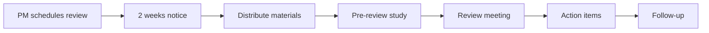

# Design Review Procedure

## Purpose
This procedure establishes a systematic approach for conducting design reviews throughout the product development lifecycle, ensuring all requirements are met and risks are identified early.

## Scope
Applies to all hardware, firmware, and software development projects at Arribada Initiative.

## Design Review Gates

### Gate 1: Concept Design Review (CDR)

**Timing:** 2-3 weeks after project kickoff

**Objectives:**
- Validate requirements understanding
- Confirm technical approach feasibility
- Identify major risks and challenges
- Approve concept direction

**Required Documents:**
- Requirements specification
- Concept sketches/block diagrams
- Technology trade-offs analysis
- Preliminary risk assessment
- Budget estimate

**Review Criteria:**
```markdown
## Concept Design Review Checklist

### Requirements
- [ ] All stakeholder needs captured
- [ ] Requirements are measurable
- [ ] Acceptance criteria defined
- [ ] Constraints documented
- [ ] Priority levels assigned

### Technical Approach
- [ ] Architecture makes sense
- [ ] Technology choices justified
- [ ] Interfaces defined
- [ ] Performance achievable
- [ ] Standards compliance planned

### Resources
- [ ] Team has required skills
- [ ] Timeline is realistic
- [ ] Budget is adequate
- [ ] Tools available
- [ ] Dependencies identified

### Risks
- [ ] Technical risks identified
- [ ] Mitigation strategies defined
- [ ] Contingency plans exist
- [ ] Impact assessment complete
- [ ] Owner assigned to each risk
```

### Gate 2: Preliminary Design Review (PDR)

**Timing:** 6-8 weeks into development

**Objectives:**
- Review detailed architecture
- Validate design decisions
- Confirm prototype plan
- Approve proceeding to prototyping

**Required Documents:**
- System architecture document
- Detailed block diagrams
- Interface control documents
- Prototype test plan
- Updated risk register

**Hardware Specific:**
- Schematic design (>75% complete)
- Component selection justification
- Power budget analysis
- Mechanical concept
- Thermal analysis

**Firmware/Software Specific:**
- Software architecture document
- API specifications
- State machine diagrams
- Memory map
- Task prioritization

### Gate 3: Critical Design Review (CDR)

**Timing:** Before production/release

**Objectives:**
- Verify design meets all requirements
- Confirm testing is complete
- Approve for production/release
- Validate documentation

**Required Documents:**
- Complete design package
- Test reports
- Manufacturing plan
- User documentation
- Compliance certificates

**Exit Criteria:**
- All requirements verified
- All tests passed
- Documentation complete
- Manufacturing validated
- Risks acceptable

## Review Process

### 1. Scheduling



**Timeline:**
- T-14 days: Schedule review, invite participants
- T-7 days: Distribute review materials
- T-3 days: Reviewer questions due
- T-0: Review meeting
- T+3 days: Meeting minutes distributed
- T+7 days: Action items addressed

### 2. Participants

**Core Review Team:**
- Project Manager (Chair)
- Technical Lead
- Quality Manager
- Domain Expert(s)

**Additional Participants (as needed):**
- Customer representative
- Manufacturing partner
- Regulatory expert
- External consultant

### 3. Review Meeting Structure

**Standard Agenda (2 hours):**
```
1. Introduction (10 min)
   - Objectives
   - Agenda
   - Previous actions

2. Design Presentation (45 min)
   - Requirements summary
   - Design overview
   - Key decisions
   - Test results

3. Technical Deep Dive (45 min)
   - Detailed review
   - Q&A session
   - Risk discussion

4. Action Items (15 min)
   - Issues identified
   - Owners assigned
   - Due dates set

5. Go/No-Go Decision (5 min)
   - Vote
   - Conditions
   - Next steps
```

### 4. Documentation

**Review Package Contents:**
```
review_package/
├── 01_Agenda.md
├── 02_Requirements_Matrix.xlsx
├── 03_Design_Documents/
│   ├── Architecture.md
│   ├── Schematics.pdf
│   └── Software_Design.md
├── 04_Test_Results/
│   ├── Unit_Tests.html
│   ├── Integration_Tests.pdf
│   └── Performance_Data.xlsx
├── 05_Risk_Register.xlsx
└── 06_Compliance_Matrix.xlsx
```

**Meeting Minutes Template:**
```markdown
# Design Review Minutes

**Project:** [Name]
**Review Type:** [CDR/PDR/CDR]
**Date:** [Date]
**Participants:** [List]

## Summary
[Brief overview of review outcome]

## Requirements Review
- Requirements coverage: X%
- Open requirements: [List]
- Changes identified: [List]

## Technical Review Findings
1. [Finding 1]
   - Impact: [High/Medium/Low]
   - Action: [Required action]
   - Owner: [Name]
   - Due: [Date]

## Risk Assessment
- New risks identified: [Count]
- Risks retired: [Count]
- High-priority risks: [List]

## Decision
[ ] Approved to proceed
[ ] Approved with conditions
[ ] Requires re-review
[ ] Not approved

## Action Items
| ID | Action | Owner | Due Date | Priority |
|----|--------|-------|----------|----------|
| 1 | [Action] | [Name] | [Date] | [H/M/L] |

## Next Steps
[What happens next]

**Minutes approved by:** [Name], [Date]
```

## Special Review Types

### Safety Review
Required when:
- High voltage (>48V) present
- High temperature (>60°C) operation
- Mechanical hazards exist
- Chemical hazards present

Additional criteria:
- Failure modes analysis
- Safety interlocks verified
- Warning labels defined
- User manual warnings

### Security Review
Required when:
- Cryptographic functions used
- Personal data handled
- Network connectivity present
- Firmware updates supported

Additional criteria:
- Threat model documented
- Penetration testing results
- Secure coding practices
- Update mechanism security

### Regulatory Review
Required when:
- Radio transmitters included
- Medical/veterinary use
- International deployment
- Environmental claims made

Additional criteria:
- Compliance testing plan
- Documentation requirements
- Certification timeline
- Regional variations

## Non-Conformance Handling

### During Review
If significant issues found:
1. Document non-conformance
2. Assess impact
3. Determine correction needed
4. Set re-review date
5. Notify stakeholders

### Non-Conformance Report (NCR)
```markdown
## NCR #[Number]

**Date:** [Date]
**Project:** [Name]
**Severity:** [Critical/Major/Minor]

### Description
[Detailed description of issue]

### Impact
- Schedule: [Impact]
- Cost: [Impact]
- Performance: [Impact]
- Safety: [Impact]

### Root Cause
[5 Whys analysis]

### Corrective Action
1. Immediate: [Action]
2. Long-term: [Action]

### Verification
- Method: [How to verify]
- Criteria: [Success criteria]
- Due date: [Date]

**Raised by:** [Name]
**Assigned to:** [Name]
**Closed by:** [Name], [Date]
```

## Metrics and Improvement

### Review Effectiveness Metrics
- On-time review completion: Target > 90%
- Actions closed on schedule: Target > 85%
- Issues found post-review: Target < 5%
- Re-review rate: Target < 10%

### Continuous Improvement
- Quarterly metrics review
- Lessons learned sessions
- Process optimization
- Tool improvements
- Training updates

## Tools and Templates

### Review Tools
- **Documentation:** Markdown + Git
- **Schematics:** KiCad + PDF export
- **Tracking:** GitHub Issues/Projects
- **Metrics:** Dashboard (Grafana)

### Templates Available
- [Concept Review Package](/docs/quality/templates/concept-review-package)
- [PDR Checklist](/docs/quality/templates/pdr-checklist)
- [CDR Report](/docs/quality/templates/cdr-report)
- [Action Tracker](/docs/quality/templates/action-tracker)

## Training Requirements

### For Reviewers
- Design review process (2 hours)
- Domain-specific training
- Tool familiarity
- Regulatory awareness

### For Presenters
- Presentation skills
- Documentation standards
- Review package preparation
- Action item management

