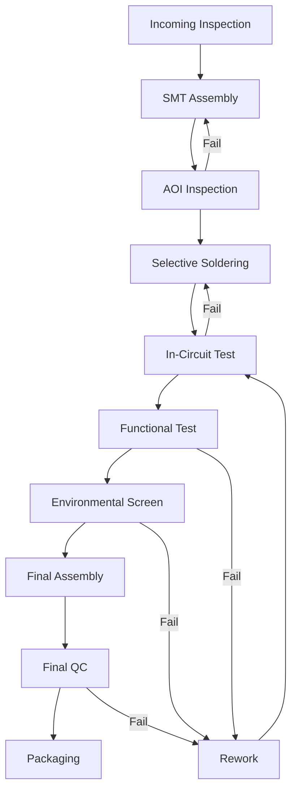

# Manufacturing Quality Control

## Purpose
This procedure ensures consistent quality in the manufacturing of Arribada hardware products through systematic inspection, testing, and process control.

## Scope
Applies to all hardware manufacturing activities, whether performed internally or by contract manufacturers.

## Manufacturing Process Flow



## Incoming Material Inspection

### Component Verification
```markdown
## Incoming Inspection Checklist

**Date:** ___________
**Inspector:** ___________
**PO Number:** ___________

### Visual Inspection
- [ ] Packaging intact
- [ ] No moisture indicators triggered
- [ ] Labels match PO
- [ ] Quantity correct
- [ ] Date codes acceptable

### Component Checks (Sample)
- [ ] Part markings correct
- [ ] Package type matches
- [ ] Pin 1 indicators present
- [ ] No physical damage
- [ ] MSL rating observed

### Documentation
- [ ] CoC received
- [ ] RoHS compliance
- [ ] Datasheet on file
- [ ] Traceability info recorded

### Storage
- [ ] MSL storage requirements met
- [ ] ESD precautions taken
- [ ] Location recorded in system
- [ ] FIFO rotation marked
```

### Acceptance Criteria
- 100% inspection for critical components
- AQL 0.65 Level II for standard components
- Zero defects for safety-critical parts

## PCB Assembly Control

### Pre-Assembly Setup
1. **Stencil Inspection**
   - Aperture dimensions verified
   - No damage or contamination
   - Thickness appropriate for paste

2. **Machine Setup**
   - Feeders calibrated
   - Placement programs verified
   - First article inspection planned
   - Reflow profile loaded

3. **Environmental Control**
   - Temperature: 20-25°C
   - Humidity: 40-60% RH
   - ESD controls active
   - Clean room protocols

### First Article Inspection

**Required for:**
- New product introduction
- After design changes
- New manufacturing lot
- Machine maintenance
- Shift changes

**Inspection Points:**
```markdown
## First Article Report

**Product:** ___________
**Revision:** ___________
**Date:** ___________
**Lot #:** ___________

### Solder Paste Inspection (SPI)
- [ ] Coverage: >85%
- [ ] Height: ±15% of stencil
- [ ] Bridge risk: <5%
- [ ] Alignment: ±0.05mm

### Component Placement
- [ ] All components present
- [ ] Orientation correct
- [ ] Alignment: ±0.1mm
- [ ] No tombstoning

### Post-Reflow
- [ ] Solder joints formed
- [ ] No bridges
- [ ] No cold joints
- [ ] Component shift <10%

**Result:** [ ] Pass [ ] Fail
**Approved by:** ___________
```

### Automated Optical Inspection (AOI)

**Program Requirements:**
- Component presence/absence
- Component offset/skew
- Solder bridge detection
- Insufficient solder detection
- Polarity check
- OCR for critical parts

**Accept/Reject Criteria:**
- False call rate: < 5%
- Escape rate: 0%
- Review all failures
- Document defect types

## Testing Procedures

### In-Circuit Test (ICT)

**Test Coverage:**
- Component presence
- Component values (±5%)
- Short circuits
- Open circuits
- Supply voltages
- Clock signals

**Fixture Maintenance:**
- Weekly cleaning
- Monthly calibration
- Probe replacement at 100k cycles
- Test program revision control

### Functional Test

**Horizon Platform Example:**
```python
# Test Sequence
class HorizonFunctionalTest:
    def __init__(self):
        self.test_fixture = TestFixture("HRZ-4.0")
        self.results = TestResults()
    
    def run_test_sequence(self):
        tests = [
            self.test_power_supplies,
            self.test_microcontroller,
            self.test_sensors,
            self.test_gps,
            self.test_satellite_modem,
            self.test_flash_memory,
            self.test_battery_charging,
            self.test_sleep_current
        ]
        
        for test in tests:
            result = test()
            self.results.add(test.__name__, result)
            if not result.passed:
                return False
                
        return True
    
    def test_power_supplies(self):
        """Test all voltage rails"""
        rails = {
            "3V3": (3.2, 3.4),
            "1V8": (1.75, 1.85),
            "VBAT": (3.5, 4.2)
        }
        # Implementation...
```

**Test Limits:**
```
| Parameter | Min | Typical | Max | Units |
|-----------|-----|---------|-----|-------|
| VCC_3V3 | 3.20 | 3.30 | 3.40 | V |
| Sleep Current | - | 45 | 60 | μA |
| GPS TTFF | - | 28 | 35 | s |
| RF Power | 13 | 14 | 15 | dBm |
| Flash Write | 80 | 100 | - | KB/s |
```

### Environmental Screening

**Temperature Cycling:**
- Low: -20°C
- High: +60°C
- Ramp rate: 5°C/min
- Dwell time: 10 min
- Cycles: 5

**Functional During Environmental:**
- Power consumption monitored
- Communication verified
- Sensors operational
- No resets or lockups

## Quality Control Points

### Visual Inspection Standards

**IPC-A-610 Class 2 Requirements:**
- Solder joint criteria
- Component mounting
- Cleanliness standards
- Mechanical assembly

**Arribada-Specific:**
```markdown
## Visual Inspection Criteria

### Solder Joints
- [ ] Wetting angle <90°
- [ ] Fillet formation proper
- [ ] No cold joints
- [ ] No fractured joints
- [ ] Heel fillet >25% height

### Component Placement
- [ ] No tombstoning
- [ ] Side overhang <50%
- [ ] End overlap >75%
- [ ] No billboarding
- [ ] Polarity markers visible

### PCB Condition
- [ ] No delamination
- [ ] No measling/crazing
- [ ] Soldermask intact
- [ ] Silkscreen legible
- [ ] No contamination

### Conformal Coating (if applied)
- [ ] Complete coverage
- [ ] No bubbles
- [ ] Keep-out areas clear
- [ ] Thickness 25-75μm
- [ ] UV inspection passed
```

### Critical Defect Categories

**Class A - Critical (0% AQL):**
- Safety hazards
- Total malfunction
- Regulatory non-compliance
- Wrong component
- Missing component

**Class B - Major (0.65% AQL):**
- Reduced reliability
- Intermittent function
- Cosmetic in visible area
- Performance degradation

**Class C - Minor (1.5% AQL):**
- Cosmetic in hidden area
- Documentation errors
- Non-critical dimension

## Process Control

### Statistical Process Control (SPC)

**Key Metrics Tracked:**
- First Pass Yield (FPY)
- Defects Per Million Opportunities (DPMO)
- Test yield by station
- Rework rate
- Field return rate

**Control Charts:**
```
Upper Control Limit (UCL) = μ + 3σ
Center Line (CL) = μ
Lower Control Limit (LCL) = μ - 3σ

Actions:
- 1 point outside limits: Investigate
- 7 points on one side: Process shift
- 7 points trending: Drift detection
```

### Traceability Requirements

**Serial Number Format:**
```
HRZ-YYWW-XXXX
│   │    │
│   │    └── Sequential (0001-9999)
│   └────────── Year + Week
└────────────────── Product Code
```

**Tracked Information:**
- Manufacturing date
- Lot codes for key components
- Test results
- Firmware version
- Operator ID
- Rework history

### Manufacturing Record

```markdown
## Device History Record

**Serial Number:** HRZ-2425-0142
**Build Date:** 2024-06-20
**Work Order:** WO-2024-0625

### Assembly
- SMT Operator: JD
- Hand Assembly: MC
- QC Inspector: RP

### Component Lots
- MCU: LOT-240515-STM
- GPS: LOT-240601-UBX
- Modem: LOT-240610-ARG

### Test Results
- ICT: PASS (2024-06-20 14:32)
- Functional: PASS (2024-06-20 15:45)
- Environmental: PASS (2024-06-21 09:00)

### Firmware
- Version: 1.2.3
- Flashed: 2024-06-21 10:15
- Verified: SHA-256 match

### Quality
- Visual QC: PASS (RP)
- Final QC: PASS (QM)
- Packed: 2024-06-21 11:00
```

## Rework Procedures

### Rework Authorization
- Level 1: Operator (cosmetic only)
- Level 2: Technician (component replacement)
- Level 3: Engineer (design-related)

### Rework Limits
- Maximum 2 rework cycles
- BGA/QFN: 1 rework only
- Document all rework
- Re-test after rework
- Update device history

### Rework Documentation
```markdown
## Rework Report

**Serial:** ___________
**Date:** ___________
**Technician:** ___________

### Defect
- [ ] Solder bridge
- [ ] Cold joint
- [ ] Missing component
- [ ] Wrong component
- [ ] Damaged component
- [ ] Other: ___________

### Action Taken
- [ ] Reflow
- [ ] Add solder
- [ ] Remove solder
- [ ] Replace component
- [ ] Add component

### Verification
- [ ] Visual inspection
- [ ] ICT retest
- [ ] Functional retest
- [ ] Environmental rescreen

**Result:** [ ] Pass [ ] Fail
**QC Approval:** ___________
```

## Packaging and Shipping

### Final Packaging Checklist
```markdown
## Packaging Verification

**Order:** ___________
**Quantity:** ___________
**Ship Date:** ___________

### Product Preparation
- [ ] Firmware verified
- [ ] Serial numbers recorded
- [ ] Calibration data included
- [ ] Visual inspection passed
- [ ] Accessories included

### Packaging Materials
- [ ] ESD bags used
- [ ] Desiccant included
- [ ] Shock absorbing material
- [ ] Moisture indicator
- [ ] Fragile labels

### Documentation
- [ ] User manual
- [ ] Quick start guide
- [ ] Warranty card
- [ ] Compliance certificates
- [ ] Packing list

### Shipping
- [ ] Address verified
- [ ] Insurance adequate
- [ ] Tracking enabled
- [ ] Export docs (if needed)
- [ ] Customer notified
```

## Continuous Improvement

### Yield Analysis
- Weekly yield review
- Pareto analysis of defects
- Root cause investigation
- Corrective action tracking
- Supplier feedback

### Customer Feedback Integration
- Field failure analysis
- RMA root cause
- Design improvements
- Process updates
- Training needs

### Audit Schedule
- Internal audits: Quarterly
- Supplier audits: Annually
- Customer audits: As requested
- Certification audits: Per standard

