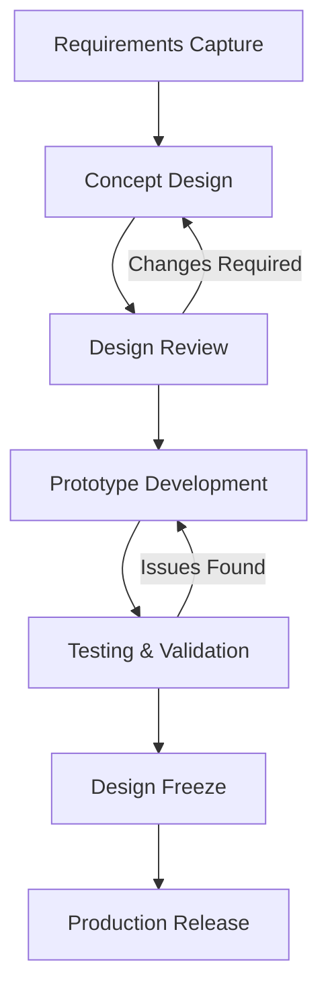
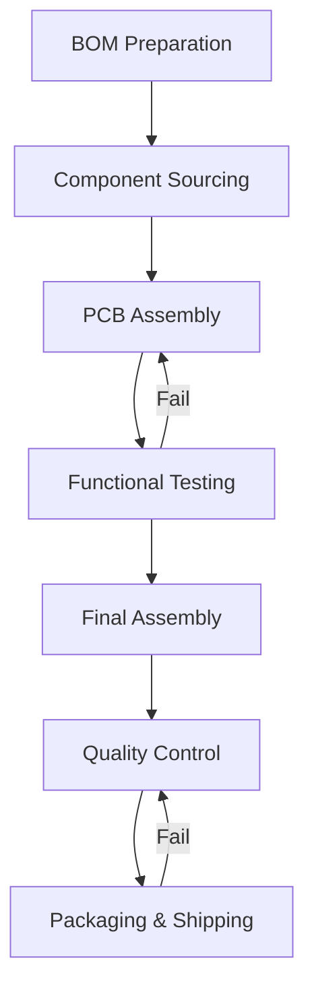
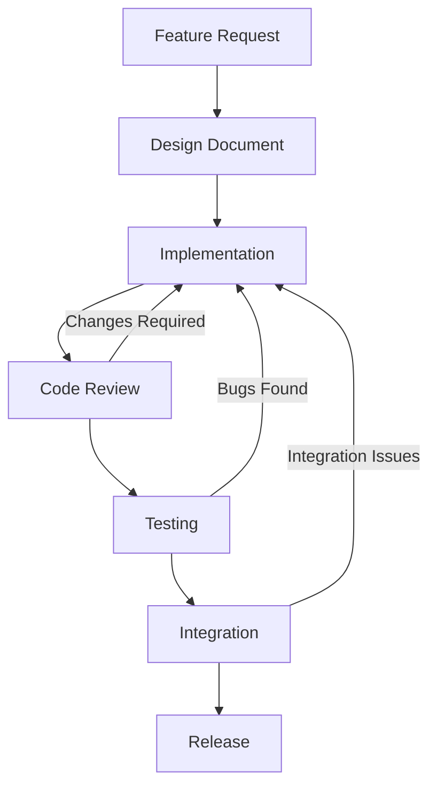

# Arribada Quality Manual

## Document Purpose & Scope

### Purpose
This Quality Manual defines the Quality Management System (QMS) for Arribada Initiative, ensuring our conservation technology meets the highest standards of reliability, safety, and effectiveness. It applies to all hardware, firmware, and software development activities across the organization.

### Scope
This QMS covers:
- **Product Development**: From concept to deployment
- **Manufacturing**: Hardware production and assembly
- **Software/Firmware**: Development and release processes
- **Field Deployment**: Installation and commissioning
- **Support Services**: Maintenance and updates

### Exclusions
- Pure research activities without product intent
- Third-party manufactured components (covered by supplier QMS)

## Context of the Organization

### Internal Factors

**Organizational Structure**
- Open-source development model
- Distributed team across multiple time zones
- Mix of employees, contractors, and community contributors
- Cross-functional teams (hardware, firmware, software, field)

**Resources**
- Technical expertise in conservation technology
- Established partnerships with conservation organizations
- Access to field testing locations
- Community of active contributors

**Culture & Values**
- Open-source first approach
- Conservation impact priority
- Collaborative development
- Continuous learning

### External Factors

**Regulatory Environment**
- Radio frequency regulations (FCC, CE, EMC & EMI Testing)
- Environmental protection standards (IP Ratings)
- Wildlife research permits and ethical requirements
- Data protection regulations (GDPR, local laws)

**Market Requirements**
- Extreme environment operation (-40°C to +85°C)
- Long-term deployments (2+ years)
- Remote locations with no maintenance access
- Limited budgets for conservation organizations

**Stakeholders**
- Conservation researchers
- Government agencies
- NGOs and wildlife organizations
- Academic institutions
- Local communities
- Technology partners

## Quality Policy & Objectives

### Quality Policy

> "Arribada Initiative is committed to developing and delivering open-source conservation technology that exceeds the reliability and performance requirements of field researchers while remaining accessible and affordable. We achieve this through rigorous testing, continuous improvement, and active collaboration with our user community."

### Quality Objectives

1. **Reliability**
   - Target: > 95% device survival rate at 12 months
   - Measure: Field deployment reports
   - Review: Quarterly

2. **Performance**
   - Target: Meet or exceed specified battery life
   - Measure: Power consumption testing
   - Review: Each release

3. **Accessibility**
   - Target: < 2 week lead time for standard configurations
   - Measure: Order to delivery time
   - Review: Monthly

4. **Customer Satisfaction**
   - Target: >90% satisfaction score
   - Measure: User surveys and support tickets
   - Review: Quarterly

5. **Continuous Improvement**
   - Target: 10% year-over-year improvement in key metrics
   - Measure: Trend analysis
   - Review: Annually

## Processes Overview

### Design & Development Process



### Manufacturing Process



### Software/Firmware Process



## Design Review Checklist

### Hardware Design Review

#### Schematic Review
- [ ] All components have valid part numbers
- [ ] Parts selected are not End of Life or Not Recommended for New Designs.
- [ ] Power budget calculated (including thermal requirements) and within limits
- [ ] Style guidelines followed
- [ ] Protection circuits implemented (ESD, reverse polarity)
- [ ] Test points accessible
- [ ] Connector pinouts verified
- [ ] Reference designs consulted
- [ ] Simulation results reviewed

#### PCB Layout Review
- [ ] Design rules check (DRC) passed
- [ ] Impedance control specified where needed
- [ ] Thermal analysis completed
- [ ] Mechanical constraints met
- [ ] Assembly considerations reviewed
- [ ] Panelization optimized
- [ ] Gerber files, drill and pick & place files generated and verified

#### Mechanical Review
- [ ] Enclosure design fits PCB and components
- [ ] Environmental sealing specified (IP rating)
- [ ] Thermal management adequate
- [ ] Mounting and deployment considered
- [ ] Drop/shock testing planned
- [ ] Manufacturing tolerances specified

### Firmware Design Review

#### Architecture Review
- [ ] Requirements documented and traced
- [ ] System architecture documented
- [ ] Interface specifications defined
- [ ] Power management strategy clear
- [ ] Error handling comprehensive
- [ ] Security considerations addressed

#### Code Review
- [ ] Coding standards followed
- [ ] Unit tests written (>80% coverage)
- [ ] Integration tests defined
- [ ] Memory usage analyzed
- [ ] Performance benchmarks met
- [ ] Documentation complete

### Risk Assessment

#### Technical Risks
- [ ] Single points of failure identified
- [ ] Failure modes analyzed (FMEA)
- [ ] Mitigation strategies defined
- [ ] Testing plans address risks
- [ ] Fallback options available

#### Project Risks
- [ ] Component availability confirmed
- [ ] Lead times acceptable
- [ ] Budget constraints met
- [ ] Timeline realistic
- [ ] Resource allocation adequate

### Compliance & Approval

#### Regulatory Compliance
- [ ] FCC/CE/EMC & EMI requirements identified
- [ ] Test plan for compliance defined
- [ ] Documentation prepared
- [ ] Pre-compliance testing completed

#### Client/User Approval
- [ ] Requirements review with client
- [ ] Prototype demonstration conducted
- [ ] Feedback incorporated
- [ ] Sign-off obtained
- [ ] Change management process defined

## Design & Development Control Procedure

### 1. Requirements Capture and Validation

**Inputs:**
- User stories from researchers
- Technical specifications
- Regulatory requirements
- Environmental constraints
- Budget limitations

**Process:**
1. Conduct stakeholder interviews
2. Document requirements in issue tracker
3. Create requirements traceability matrix
4. Review with stakeholders
5. Obtain sign-off on requirements

**Outputs:**
- Requirements specification document
- Acceptance criteria
- Test plan outline

### 2. Resource Planning

**Team Assignment:**
```yaml
project:
  lead: Project Manager
  technical_lead: Senior Engineer
  team:
    hardware:
      - lead: Hardware Engineer
      - support: PCB Designer
    firmware:
      - lead: Firmware Engineer
      - support: Embedded Developer
    software:
      - lead: Software Engineer
      - support: Frontend Developer
    testing:
      - lead: QA Engineer
      - support: Field Technician
```

**Resource Allocation:**
- Development equipment and tools
- Testing facilities and equipment
- Field testing locations
- Budget allocation by phase

### 3. Design Control

**Version Control:**
- Hardware: Git + KiCad/Eagle or Altium
- Firmware: Git + Zephyr
- Software: Git + CI/CD
- Documentation: Git + Markdown

**Change Management:**
1. All changes through pull requests
2. Impact assessment required
3. Review by technical lead
4. Testing of changes
5. Documentation updates
6. Stakeholder notification

### 4. Design Review Process

**Review Gates:**
1. **Concept Review** (Week 2)
   - Feasibility assessment
   - Technology selection
   - Risk identification

2. **Preliminary Design Review** (Week 6)
   - Architecture approval
   - Interface definitions
   - Prototype plan

3. **Critical Design Review** (Week 12)
   - Detailed design complete
   - Test results reviewed
   - Manufacturing plan

4. **Production Readiness Review** (Week 16)
   - All testing complete
   - Documentation finalized
   - Manufacturing validated

### 5. Validation Process

**Internal Validation:**
- Unit testing (automated)
- Integration testing
- Environmental testing
- Field testing (beta)

**Client Validation:**
- Prototype demonstration
- Field trial participation
- Performance verification
- Final acceptance testing

## Roles and Responsibilities

### Quality Manager
- Maintains QMS documentation
- Conducts internal audits
- Manages non-conformances
- Drives continuous improvement
- Reports quality metrics

### Project Manager
- Defines project scope
- Allocates resources
- Manages timeline
- Facilitates reviews
- Customer communication

### Technical Lead
- Technical decision making
- Architecture oversight
- Risk assessment
- Standards compliance
- Mentoring team

### Hardware Engineer
- Schematic design
- Component selection
- PCB layout review
- Testing procedures
- Manufacturing support

### Firmware Engineer
- Embedded software development
- Hardware abstraction
- Driver development
- Power optimization
- System integration

### QA Engineer
- Test planning
- Test execution
- Defect tracking
- Performance testing
- Field support

### Manufacturing Partner
- PCB assembly
- Quality control
- Component sourcing
- Production scheduling
- Shipping logistics

## Document Control

### Document Management System

**Repository Structure:**
```
arribada-qms/
├── policies/
│   ├── QMS-POL-001_Quality_Policy.md
│   └── QMS-POL-002_Document_Control.md
├── procedures/
│   ├── QMS-PRO-001_Design_Control.md
│   ├── QMS-PRO-002_Manufacturing.md
│   └── QMS-PRO-003_Testing.md
├── work-instructions/
│   ├── QMS-WI-001_PCB_Assembly.md
│   └── QMS-WI-002_Firmware_Flash.md
├── forms/
│   ├── QMS-FRM-001_Design_Review.md
│   └── QMS-FRM-002_NCR.md
└── records/
    ├── design-reviews/
    ├── test-reports/
    └── audits/
```

### Document Numbering
```
QMS-[TYPE]-[NUMBER]_[TITLE]_v[VERSION]

Types:
- POL: Policy
- PRO: Procedure  
- WI: Work Instruction
- FRM: Form/Template
- REC: Record
```

### Revision Control

**Version Numbering:**
- Draft: v0.1, v0.2, etc.
- Released: v1.0, v2.0, etc.
- Minor updates: v1.1, v1.2, etc.

**Change History:**
| Version | Date | Author | Changes |
|---------|------|--------|---------|
| v1.0 | 2024-01-15 | J.Smith | Initial release |
| v1.1 | 2024-02-20 | M.Jones | Updated test procedures |
| v2.0 | 2024-03-10 | J.Smith | Major revision for new product |


### Access Control
- Public documents: GitHub public repo
- Internal procedures: GitHub private repo
- Confidential: Encrypted storage
- Records: Access restricted by role

## Licensing & IP Management

### Open Source Licensing

**Hardware:**
- CERN Open Hardware License v2 (CERN-OHL-S-2.0)
- Strongly reciprocal (share-alike)
- Attribution required
- Documentation included

**Firmware/Software:**
- GNU General Public License v3 (GPL-3.0)
- Copyleft license
- Source code must be provided
- Modifications must be shared

**Documentation:**
- Creative Commons BY-SA 4.0
- Attribution required
- Share-alike terms
- Commercial use allowed

### IP Reuse Guidelines

**Internal IP:**
1. Check existing component library
2. Verify license compatibility
3. Update attribution
4. Document modifications
5. Share improvements back

**External IP:**
1. License compatibility check
2. Attribution requirements
3. Modification restrictions
4. Distribution obligations
5. Legal review if unclear

**IP Register:**
| Component | Source | License | Restrictions | Attribution |
|-----------|--------|---------|--------------|-------------|
| GPS Module | Internal | CERN-OHL-S | None | Arribada |
| LoRa Stack | Semtech | BSD-3 | No warranty | Copyright notice |
| Crypto Lib | mbedTLS | Apache-2.0 | Patent grant | NOTICE file |


## Project Kickoff Checklist

### Pre-Kickoff Preparation
- [ ] Project charter drafted
- [ ] Budget approved
- [ ] Team identified
- [ ] Timeline drafted
- [ ] Risks assessed

### Kickoff Meeting Agenda

#### 1. Project Overview (30 min)
- [ ] Background and context
- [ ] Objectives and success criteria
- [ ] Scope and constraints
- [ ] Timeline and milestones
- [ ] Budget allocation

#### 2. Technical Requirements (45 min)
- [ ] Functional requirements review
- [ ] Performance specifications
- [ ] Environmental requirements
- [ ] Regulatory compliance needs
- [ ] Testing requirements

#### 3. Roles & Responsibilities (30 min)

**RACI Matrix:**
```
R = Responsible (does the work)
A = Accountable (approves)
C = Consulted (provides input)
I = Informed (kept updated)
```
| Task | PM | TL | HW | FW | QA | Client |
|------|----|----|----|----|----|----|
| Requirements | A | R | C | C | C | I |
| Design | I | A | R | R | C | I |
| Testing | I | C | C | C | R | I |
| Deployment | A | C | I | I | R | C |


#### 4. Communication Plan (15 min)
- [ ] Meeting cadence (weekly/bi-weekly)
- [ ] Status report format
- [ ] Issue escalation path
- [ ] Documentation requirements
- [ ] Client touchpoints

#### 5. Testing Strategy (30 min)

**Testing Levels:**
1. **Unit Testing**
   - Responsibility: Developers
   - Coverage target: >80%
   - Automated: Yes

2. **Integration Testing**
   - Responsibility: QA Team
   - Test scenarios defined
   - Hardware-in-loop required

3. **System Testing**
   - Responsibility: QA Team
   - Full functionality verification
   - Performance validation

4. **Field Testing**
   - Responsibility: Field Team + Client
   - Real-world conditions
   - Duration: 2-4 weeks minimum

#### 6. IP and Licensing (15 min)
- [ ] License model confirmed
- [ ] IP reuse opportunities identified
- [ ] Attribution requirements noted
- [ ] Distribution terms agreed
- [ ] Contribution agreement signed

#### 7. Risk Management (15 min)
- [ ] Technical risks identified
- [ ] Mitigation strategies defined
- [ ] Contingency plans outlined
- [ ] Risk owners assigned
- [ ] Review schedule set

### Post-Kickoff Actions
- [ ] Meeting minutes distributed
- [ ] Action items assigned in tracker
- [ ] Project repository created
- [ ] Access permissions granted
- [ ] First sprint planned

## Continuous Improvement

### Metrics Dashboard

**Key Performance Indicators:**
- First-pass yield rate
- Field failure rate
- Time to market
- Customer satisfaction score
- Cost per unit

**Review Frequency:**
- Weekly: Project metrics
- Monthly: Quality metrics
- Quarterly: Strategic review
- Annually: QMS audit

### Improvement Process

1. **Identify** opportunities through:
   - Customer feedback
   - Field failure analysis
   - Process metrics
   - Team suggestions

2. **Analyze** root causes using:
   - 5 Whys technique
   - Fishbone diagrams
   - Pareto analysis
   - Data trends

3. **Implement** improvements via:
   - Process updates
   - Tool enhancements
   - Training programs
   - Design changes

4. **Verify** effectiveness through:
   - Metric monitoring
   - A/B testing
   - User feedback
   - Audit results

## Appendices

### A. Acronyms and Definitions
- **QMS**: Quality Management System
- **FMEA**: Failure Mode and Effects Analysis
- **DRC**: Design Rule Check
- **NCR**: Non-Conformance Report
- **RACI**: Responsible, Accountable, Consulted, Informed

### B. Reference Documents
- [Contributing Guidelines](/docs/community/contributing/overview)
- [Code Standards](/docs/community/contributing/code-standards)
- [Testing Guidelines](/docs/community/contributing/testing)
- [Hardware Specifications](/docs/hardware/specs/datasheets)

### C. Forms and Templates
- [Design Review Template](https://github.com/arribada/qms-templates/design-review)
- [Test Report Template](https://github.com/arribada/qms-templates/test-report)
- [NCR Form](https://github.com/arribada/qms-templates/ncr)
- [Change Request Form](https://github.com/arribada/qms-templates/change-request)

---

**Document Control:**
- Version: 1.0
- Effective Date: July 8, 2025
- Review Date: July 8, 2025
- Owner: Engineering Manager
- Approval: Executive Director
